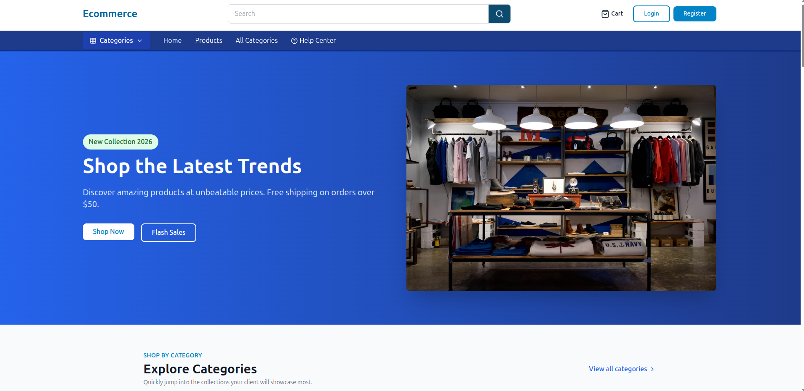
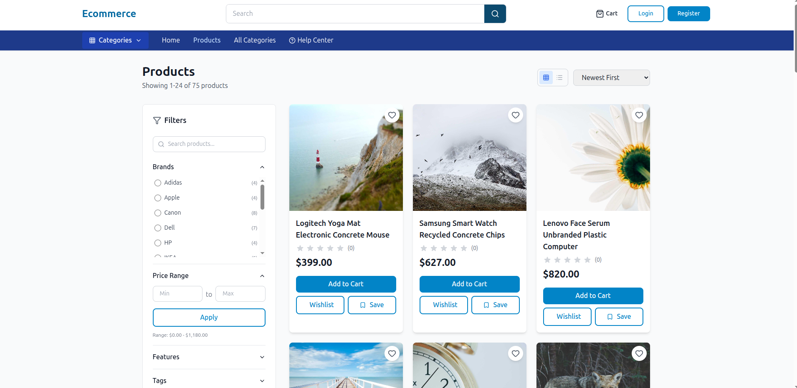
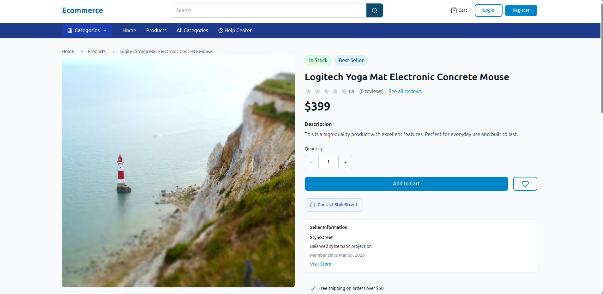

# MERN E-commerce Platform — Frontend

Full-stack multi-vendor marketplace frontend built with React.js, Vite, and Tailwind CSS. Three separate dashboards for Customers, Sellers, and Admins with real-time chat and complete e-commerce flow.

🔗 **Live Demo:** https://talha-mern-shop.netlify.app/
📁 **Backend Repo:** https://github.com/talha-sajjad-dev/mern-ecommerce-backend

---

## Screenshots

### Homepage


### Products Listing


### Product Detail


---

## Features

### Customer Experience
- Browse products by category, brand, price range, and features
- Product search with filters and sorting
- Add to cart, wishlist, and save for later
- Full checkout flow with address management
- Stripe, PayPal, and COD payment options
- Order tracking with real-time status updates
- Returns and refund requests
- Real-time chat with sellers
- Support ticket system

### Seller Dashboard (/seller/*)
- Product management (add, edit, bulk upload)
- Order management with sub-order fulfillment
- Sales analytics and revenue tracking
- Real-time customer messaging
- Store profile and payout settings
- Product performance metrics

### Admin Dashboard (/admin/*)
- Seller approval and management
- Platform-wide order and user management
- Category, brand, and option management
- Commission rate configuration
- Coupon management
- CMS and platform settings
- Dispute and return request handling
- Support ticket management

### Technical Highlights
- React Context API for global state (Auth, Cart, Wishlist, Notifications)
- React Hook Form for all form handling
- Socket.IO client for real-time chat and notifications
- Google OAuth integration
- Cloudinary + Uploadcare for media uploads
- React Easy Crop for in-app image editing

---

## Tech Stack

| Category | Technology |
|---|---|
| Framework | React.js + Vite |
| Styling | Tailwind CSS |
| Icons | Lucide React, React Icons |
| Forms | React Hook Form |
| Payments | Stripe.js, PayPal SDK |
| Real-time | Socket.IO Client |
| Auth | JWT, Google OAuth |
| Notifications | React Hot Toast |
| File Upload | React Dropzone, Uploadcare |

---

## Pages

**Public:** Home, Products, Product Detail, Categories, Seller Store, Cart, Checkout, Help Center, FAQ

**Auth:** Login, Register, Forgot Password, OTP Verification, Seller Register, Admin Login

**User Dashboard:** Orders, Tracking, Wishlist, Saved Items, Profile, Returns, Messages, Support

**Seller Dashboard:** Products, Orders, Analytics, Revenue, Messaging, Payout Settings

**Admin Dashboard:** Users, Sellers, Orders, Products, Categories, Disputes, Commission, CMS, Settings

---

## Getting Started
```bash
# Clone the repo
git clone https://github.com/talha-sajjad-dev/mern-ecommerce-frontend
cd mern-ecommerce-frontend

# Install dependencies
npm install

# Add environment variables
cp .env.example .env
# Set VITE_API_URL to your backend URL

# Run in development
npm run dev
```

## Environment Variables
VITE_API_URL=http://localhost:5000/api
---

## Author

**Talha Sajjad** — MERN Stack Developer
📧 talhasajjad148@gmail.com
🔗 [Portfolio](https://talha-sajjad-portfolio.netlify.app)
🔗 [LinkedIn](https://linkedin.com/in/talha-sajjad-dev)
